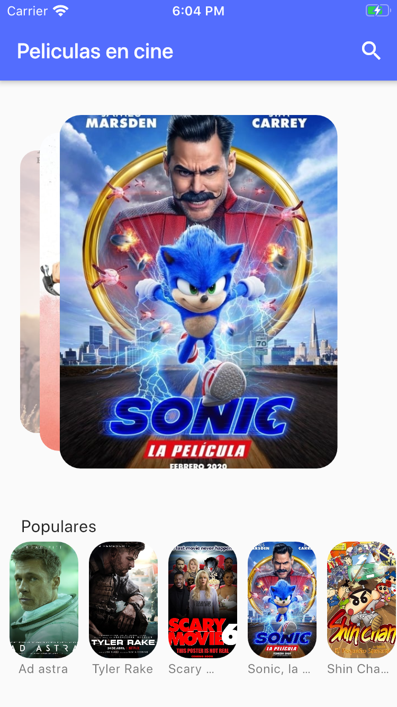
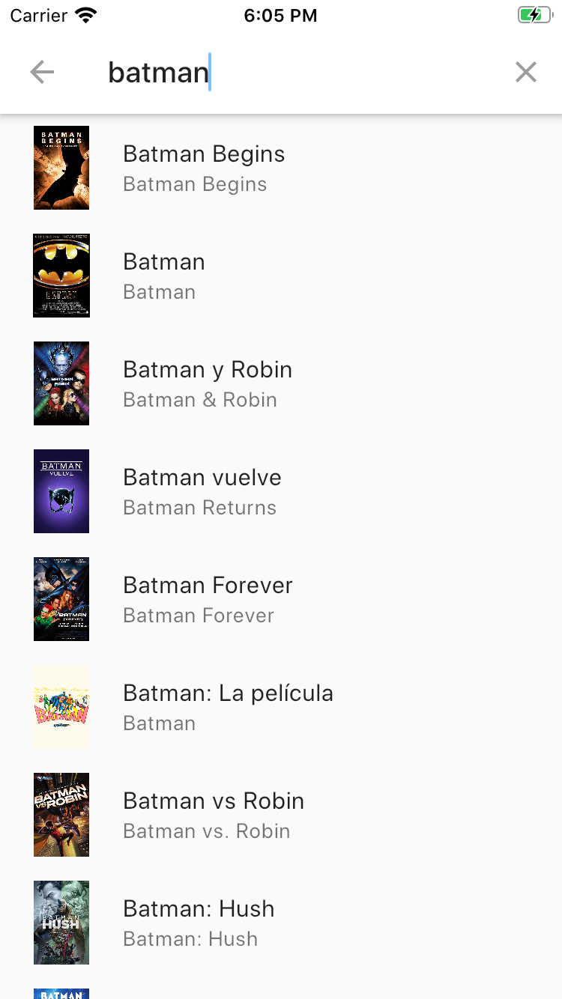

# Flutter News App

A new Flutter project that conect a real movies API https://www.themoviedb.org/

This project:
- connects a real news API
- use a custom card swiper widget
- use horizontal pageview
- use SearchDelegate to find movies while user is writing

